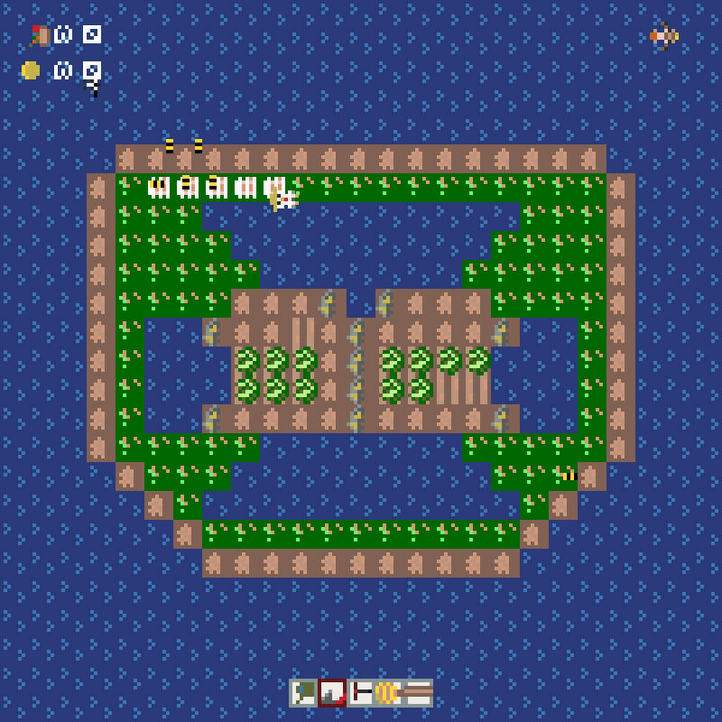
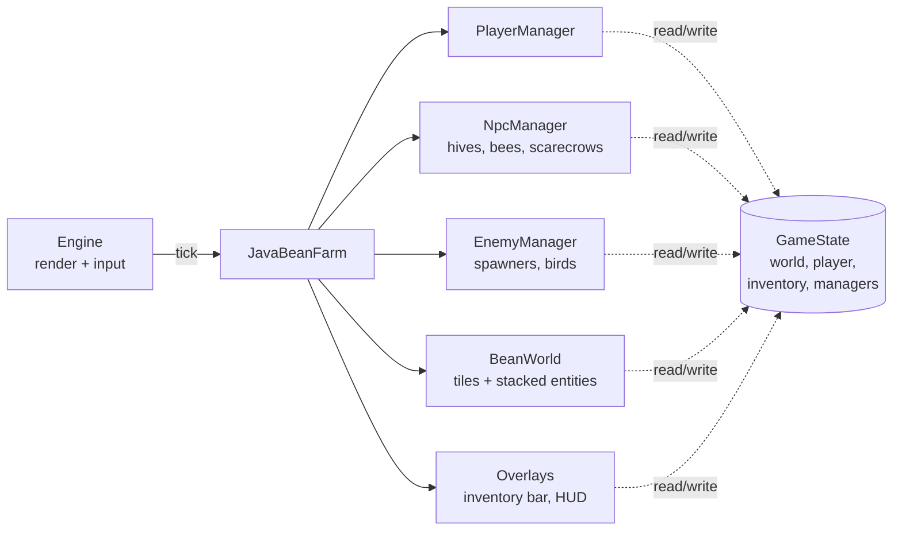

# 🐔 JavaBeans: Chicken Farmer

[](https://github.com/BrianTr9/JavaBeans-Chicken-Farmer-PITL/actions/workflows/ci.yml)
[](https://openjdk.org/projects/jdk/21/)
[](#-testing)
[](build.gradle)

A tile-based 2D farming game in Java 21. You farm crops and mine ore while thieving birds raid
the farm. Bee hives and scarecrows defend it.

<p align="center">
  
</p>

**Highlights**

- **Simulation core**: a fixed-order, per-frame tick pipeline over the player, NPCs, enemies,
  the tile world and the HUD. Entities are only marked for removal during updates and are
  cleaned up between phases, so no collection changes while it is being iterated.
- **Enemy behaviour**: three bird types with steering, theft, fleeing and lifespans, plus
  timed spawners. Guard bees chase the nearest live bird. Magpies and eagles caught before they
  get home return what they stole, exactly once, through a removal hook.
- **Data-driven levels**: a tile map plus a key/value level file. The parser rejects malformed
  or out-of-range entries with an error naming the section and the offending entry.
- **457 automated tests**: unit tests for the game logic, plus whole-game simulation tests
  that replay scripted input and analyse every rendered frame.
- **Tooling**: Gradle wrapper, Checkstyle enforced at zero warnings, Javadoc with
  design-by-contract tags, and GitHub Actions CI.

## 🚀 Quick start

```bash
./gradlew run      # play
./gradlew test     # run the test suite
./gradlew check    # tests + Checkstyle
```

A JDK between 17 and 24 is enough to start Gradle. The build compiles with Java 21 and downloads
it automatically if it is missing. On Windows use `gradlew.bat`.

## 🕹️ Gameplay

| Input | Action |
|-------|--------|
| **W A S D** | Walk (water blocks movement) |
| **1 – 5** | Select an inventory slot |
| **Left click** | Use the held tool on the tile underfoot |

| Tool | Use on | Effect |
|------|--------|--------|
| Bucket | Tilled dirt | Plant a cabbage (2 coins). It ripens in four stages |
| Hoe | Grass / dirt | Turn grass into dirt; till dirt |
| Jackhammer | Ore | Mine 2 coins every 5 ticks (10 coins per rock) |
| Hive hammer | Empty grass | Build a bee hive (2 coins + 2 food) |
| Pole | Empty tilled dirt | Build a scarecrow (2 coins) |

Walking over a ripe cabbage harvests it (+2 food, +3 coins).

| Enemy | Targets | Steals | Countered by |
|-------|---------|--------|--------------|
| Magpie | Player | 1 coin | Bees, scarecrows |
| Eagle | Player | Up to 3 food | Bees |
| Pigeon | Nearest cabbage | The cabbage | Bees, scarecrows |

Birds fly home after a theft. A magpie or eagle removed before it gets home gives back what it
stole; a stolen cabbage is gone for good.

- **Bee hive**: when a bird comes within 350 px, the hive launches a guard bee. The bee homes in
  on the nearest bird and removes it on contact, or returns to the hive when there are none.
  The hive reloads in 240 ticks, or 3× faster while the player stands on it.
- **Scarecrow**: magpies and pigeons within 4 tiles abandon their attack.

## 🏗️ Architecture



Each frame runs a fixed pipeline. Every component receives the same `GameState`, a facade over
the world, player, inventory and managers. Components use it to reach each other instead of
being wired together directly:

```
player input → NPCs → spawners + birds → tiles → NPC interactions → deferred removal → HUD
```

The HUD is updated last, so it always shows the frame's final coins and food.

| Package | Responsibility |
|---------|----------------|
| `builder` | Game controller and the `GameState` facade |
| `builder.player` | Player entity; movement, collision and tool use |
| `builder.world` | Tile storage and spatial queries; map and level-file loading |
| `builder.entities.tiles` | `Tile` base class (holds stacked entities) and tile types; `TileFactory` |
| `builder.entities.resources` | Growable crops and mineable ore |
| `builder.entities.npc` | Heading/speed movement model, NPC manager, hives, bees, scarecrows |
| `builder.entities.npc.enemies` | `Enemy` → `AbstractBird` → magpie, eagle, pigeon; enemy manager |
| `builder.entities.npc.spawners` | `AbstractBirdSpawner` (timer + spawn hook) and one spawner per bird |
| `builder.inventory` | Inventory model, tools, and the inventory/resource overlays |

Rendering, input, sprites and timers come from a small game engine (`lib/engine.jar`, see
[Background](#-background)).

## 🧠 Engineering notes

Problems found and fixed while hardening the codebase, and the design choices behind the fixes:

- **Hidden double updates → explicit pace.** Spawners registered each magpie and pigeon twice,
  so they were silently updated twice per frame. The simulation tests were already calibrated to
  that speed. Each bird is now stored once, and the pace is a declared property
  (`Enemy.ticksPerFrame`), so the observable behaviour is unchanged.
- **Lost refunds → removal hook.** Refunds ran inside a bird's own update, but a bird caught by a
  bee was removed before that update ran again, so nothing was ever returned. Removal now goes
  through `EnemyManager.cleanup`, which calls `Enemy.onRemoved` exactly once. The bird tracks
  whether it made it home.
- **Encapsulation.** Managers expose read-only views of their collections. Spawners create their
  own bird at their own position, replacing a mutable "next spawn position" on the manager.
- **Validated input.** Level-file entries are parsed as `key:value` pairs in any order. Missing
  or duplicate keys, non-integer or out-of-range values (negative positions or resources, a
  spawn interval below 1), unclosed sections and a wrong player count all produce a load error
  naming the section and, where there is one, the offending entry. Levels load with either LF
  or CRLF line endings.
- **Removed is not gone yet.** Entities are only *marked* for removal during a frame and are
  cleaned up later, so every system must skip marked ones. Several did not: bees chased and
  "caught" birds another bee had already caught (and one bee could remove a whole flock), hives
  fired at dead birds, pigeons stole cabbages the player had just harvested, a ripe cabbage
  could be harvested twice, and a bird that expired could still steal in the same tick.
- **Lifecycle leaks.** The world never dropped replaced tiles, so every hoed grass tile stayed
  behind, still ticked and drawn under the new dirt. Hives and scarecrows were updated and drawn
  twice per frame, through their tile and through the NPC manager. Level files opened by path
  were never closed.
- **Rendering correctness.** Sprites are drawn centred on their position. The inventory bar's
  layout treated positions as left edges and was off by half a tile.
- **Feet-based collision.** The player stands on the tile under their feet, not under the
  sprite's centre. Collisions use a foot box covering the bottom quarter of the sprite, so legs
  never overlap water while the head can overlap the tile behind, as in other top-down games.
  The hive's "player standing on it" reload boost uses the same feet tile.

## 🧪 Testing

| Suite | Location | Classes | Tests |
|-------|----------|:---:|:---:|
| Unit tests | `test/builder` | 24 | 377 |
| Simulation tests | `test/scenarios` | 11 | 80 |

- **Unit tests** cover the game logic: inventory, tiles and tools, crops and ore, player
  controls, the HUD, birds, bees, spawners, managers and both file loaders. Small real game
  states (`GameFixture`) are used instead of deep mocks.
- **Simulation tests** run the whole game through the real engine with a mocked input/output
  core. They record every renderable on every frame, then assert on trajectories, spawn timing,
  sprite changes and resource read-outs.
- **Regression tests** reproduce each fixed bug. New tests were checked against deliberately
  broken implementations to confirm they fail.

CI runs `./gradlew check` (compile, all tests, Checkstyle) on every push and pull request.

## 🗺️ Level files

A level is a `.map` file plus a `.details` file in `resources/`.

**`.map`**: one character per tile, one line per row (25 × 25 by default): `g` grass, `d` dirt,
`t` tilled dirt, `w` water, `o` ore.

**`.details`**: sections of `key:value` entries. Keys may appear in any order, and the `|`
prefix is optional:

```
:chickenFarmer:
|x:380 y:380 coins:20 food:30
end;

:cabbages:
|x:340 y:340
end;

:magpiespawner:
|x:5 y:5 duration:800
end;
```

The `eaglespawner` and `pigeonspawner` sections use the same format as `magpiespawner`. Every
section must be present, but it may be empty. Coordinates, coins and food must not be negative,
and `duration` (ticks between spawns) must be at least 1.

## 🧰 Tech stack

Java 21 (records, pattern matching, switch expressions) · Gradle 8 · JUnit 4 · Checkstyle ·
GitHub Actions

## 📚 Background

This project started as coursework for **CSSE2002 Programming in the Large** at the University
of Queensland (Semester 2, 2025):

- **Assignment 1**: the core game, implemented from a method-level specification.
- **Assignment 2**: a deliberately buggy, poorly structured extension (birds, spawners,
  towers). The task was to fix it, refactor it and test it. See the
  [refactoring report](docs/assignment2-refactoring-report.md).

Both assignments were later merged into this repository, keeping their full git history. That
consolidation added the fixes above, the missing tests, the build tooling and CI.

**Credits.** The game engine (`lib/engine.jar`), the simulation tests in `test/scenarios`, the
sprite art, the original specifications ([`docs/`](docs/)) and the Checkstyle configuration were
provided by the CSSE2002 course staff. One simulation's spawn point was moved so the player's
feet start on the same ore tile under feet-based collision.

**AI usage.** Assignment 1 was written without generative AI. Assignment 2 used ChatGPT and
Claude for Javadoc and an initial test baseline ([declaration](docs/ai-declaration.txt)). The
consolidation work was done with the help of Claude Code.

**Academic integrity.** You may learn from this code and reference it. Do not submit any part
of it as coursework. See the [UQ Academic Integrity policy](https://uq.mu/rl553).

## 📄 License

Educational use only. Free to view, study and reference, and to discuss in reviews or
interviews. Not to be copied into coursework or used commercially without permission.

## 👤 Author

**Trung Bao Truong**, University of Queensland, GitHub [@BrianTr9](https://github.com/BrianTr9)
